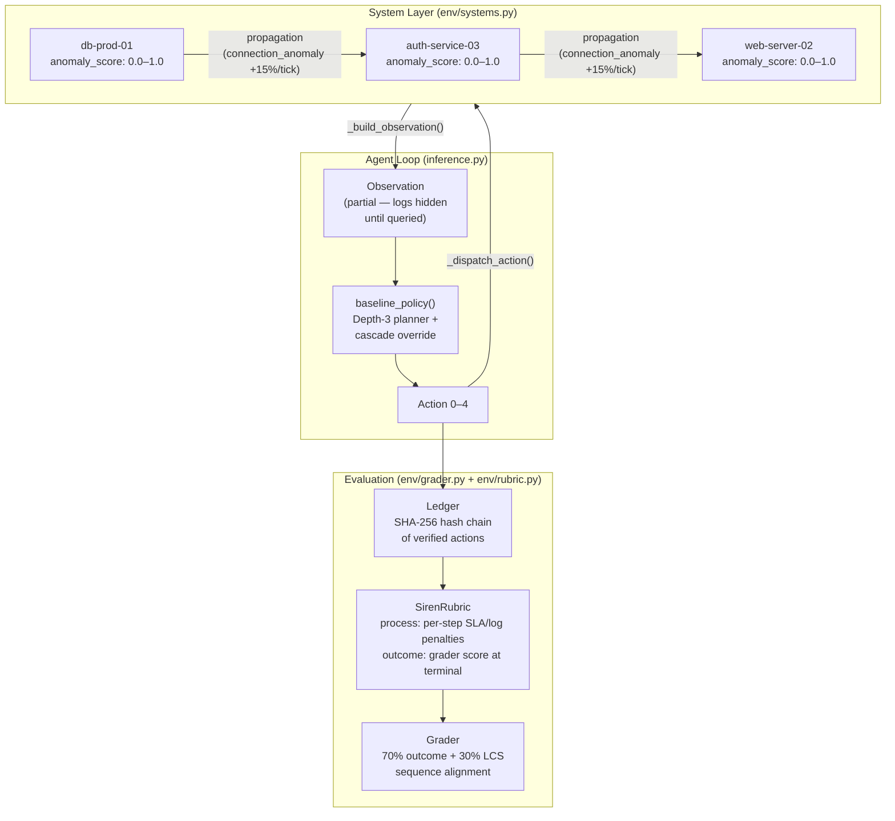

```
███████╗██╗██████╗ ███████╗███╗   ██╗
██╔════╝██║██╔══██╗██╔════╝████╗  ██║
███████╗██║██████╔╝█████╗  ██╔██╗ ██║
╚════██║██║██╔══██╗██╔══╝  ██║╚██╗██║
███████║██║██║  ██║███████╗██║ ╚████║
╚══════╝╚═╝╚═╝  ╚═╝╚══════╝╚═╝  ╚═══╝
```

**Security Incident Response ENvironment** — an RL training environment where agents learn to stop real attack chains, not just flip resolved flags.

[](https://github.com/meta-pytorch/OpenEnv)
[](https://python.org)
[](https://fastapi.tiangolo.com)
[](https://docker.com)
[](LICENSE)

---

## 🔐 The Core Idea

Every security response involves a tradeoff: act fast and leave audit gaps, or act carefully and run out of time. SIREN calls this the **Proof Gap** — the tension between speed (fast_patch resolves in 1 tick but degrades proof_score by 0.15 per missing log) and correctness (verified_patch costs 3 ticks but adds a tamper-evident ledger entry). During audit mode, fast_patch carries an additional −0.6 reward penalty on top of the base −0.4, making it a −1.0 action. Agents that learn to navigate this tradeoff — isolating root-cause systems before patching, using verified actions during audits, stopping cascades before they spread — score significantly higher than agents that simply react to the highest-severity incident.

---

## 🏗️ What Makes SIREN Different

| Dimension | Typical RL Envs | SIREN |
|-----------|----------------|-------|
| Problem domain | Abstract (CartPole, Atari) | Real attack patterns from MITRE ATT&CK |
| Agent input | Numeric vectors | Natural language scenario + system logs + IoCs |
| Ground truth | Reward function | Expert `correct_action_sequence` per scenario (LCS scoring) |
| System model | Independent state variables | Three interconnected SystemNodes with anomaly propagation (db→auth→web) |
| Reward signal | Immediate scalar | Composite: step reward + SLA drain + proof quality + sequence alignment |
| Evaluation | Episode return | Grader score: 70% outcome + 30% sequence match against expert trace |

---

## 🏗️ Architecture



---

## ⚡ Action Space

| ID | Name | Effect | Proof Impact | Tick Cost |
|----|------|--------|-------------|-----------|
| 0 | `no_op` | Advance tick, no system change | None | 1 |
| 1 | `fast_patch` | Apply patch to target system; anomaly decay starts | `missing_logs +1` (or `+2` during audit); `proof_score −0.15` | 1 |
| 2 | `verified_patch` | Apply patch with ledger entry; anomaly decay starts | `ledger_entries +1`; `proof_score +0.04`; `+0.03` bonus during audit | 3 |
| 3 | `isolate_system` | Network-isolate target; stops propagation; enables patching | `ledger_entries +1`; `sla_credits −15` | 1 |
| 4 | `escalate_human` | Flag incident for human review; adds ledger entry | `ledger_entries +1`; `audit_events_survived +1` | 1 |

---

## 🧠 Observation Schema

The agent receives a JSON observation each step. System logs and indicators are **hidden by default** — they are only populated after the agent calls `query_logs` or `inspect_system` (partial observability). The `anomaly_score` is always visible.

Below is a real observation from scenario SC-002 (ransomware on db-prod-01), after logs have been revealed:

```json
{
  "incidents": [
    {
      "id": "INC-001",
      "severity": 5,
      "type": "ransomware",
      "system": "db-prod-01",
      "time_remaining": 4,
      "resolved": false,
      "isolated": false,
      "requires_isolation": true,
      "anomaly_score": 0.891,
      "system_logs": [
        "2024-01-15 14:02:33 CRIT db-prod-01: Mass file rename detected — 847 files renamed to .locked",
        "2024-01-15 14:02:34 CRIT db-prod-01: Process svchost.exe spawning cmd.exe with vssadmin delete shadows",
        "2024-01-15 14:02:35 WARN firewall: Outbound C2 beacon to 10.0.0.99:4444 from db-prod-01",
        "2024-01-15 14:02:36 CRIT db-prod-01: CPU at 98%, disk I/O at maximum — encryption in progress",
        "2024-01-15 14:02:40 WARN auth-service-03: Unusual SMB connection attempt from db-prod-01"
      ],
      "indicators": [
        "Mass file renaming to .locked extension",
        "vssadmin delete shadows command (destroys backups)",
        "C2 beacon on port 4444",
        "Lateral movement attempt via SMB"
      ],
      "context": "db-prod-01 is exhibiting signs of active ransomware encryption. CRITICAL: The database must be isolated immediately to prevent spread to auth-service-03. Do NOT patch without isolating first.",
      "scenario_id": "SC-002"
    }
  ],
  "sla_credits": 87.3,
  "proof_score": 1.0,
  "missing_logs": 0,
  "active_sessions": 3,
  "ledger_entries": 0,
  "ledger_hash": "b94f6f125c79e3a5ffaa826f584c10d52ada669e6762051b826b55776d05a8a7",
  "current_tick": 0,
  "max_ticks": 10,
  "audit_triggered": true,
  "task_id": "hard",
  "systems_status": {
    "db":   {"anomaly_score": 0.891, "isolated": false, "patch_applied": false, "is_active": true, "propagating_to": ["auth"], "received_from": []},
    "auth": {"anomaly_score": 0.230, "isolated": false, "patch_applied": false, "is_active": false, "propagating_to": [], "received_from": ["db"]},
    "web":  {"anomaly_score": 0.458, "isolated": false, "patch_applied": false, "is_active": false, "propagating_to": [], "received_from": []}
  },
  "tool_output": "",
  "context": "db-prod-01 is exhibiting signs of active ransomware encryption...",
  "system_logs": ["2024-01-15 14:02:33 CRIT db-prod-01: Mass file rename detected..."],
  "indicators": ["Mass file renaming to .locked extension", "C2 beacon on port 4444"],
  "scenario_id": "SC-002",
  "threat_intel": "Critical multi-vector attack in progress. Audit mode active. All actions logged.",
  "ticks_remaining": 10,
  "rubric_reward": null,
  "done_reason": ""
}
```

---

## 🔐 Task Difficulties

| Property | Easy | Medium | Hard |
|----------|------|--------|------|
| Incidents | 1 (severity 3) | 2 (severity 4 + 3) | 3 (severity 5 + 4 + 3) |
| Max ticks | 15 | 8 | 10 |
| Audit | Never | 30% probability | Always (from tick 0) |
| SLA drain rate | 1.0× per session/tick | 1.0× per session/tick | 1.5× per session/tick |
| Scenarios | SC-001 (phishing) | SC-002 (ransomware), SC-008 (DNS tunneling) | SC-002, SC-006 (DDoS), SC-005 (insider threat) |
| Pass criteria | incident resolved + missing_logs == 0 + proof ≥ 0.6 | highest-severity resolved + proof ≥ 0.5 + SLA ≥ 20 | severity-5 resolved + no fast_patch during audit |
| Expected score range | 0.55–0.70 | 0.80–0.90 | 0.68–0.96 |

---

## ⚡ The Proof Gap Reward Formula

```python
# From env/reward.py — compute_reward()

reward = 0.0

if resolved_incident is not None:
    reward += 0.5 + resolved_incident.severity * 0.1   # base: 0.8–1.0 for sev 3–5

    if action == 1:  # fast_patch
        reward -= 0.4
        if audit_triggered:
            reward -= 0.6   # total: −1.0 during audit

    if action == 2:  # verified_patch
        reward += 0.2       # quality bonus

    reward += 0.1 * (remaining_sla / 100.0)  # speed incentive

if action == 0 and any(inc.severity >= 4 for inc in unresolved):
    reward -= 0.3           # idle penalty

reward -= sla_delta * 0.02  # SLA drain cost
reward -= (new_missing_logs - old_missing_logs) * 0.03  # proof degradation
```

- **fast_patch during audit is −1.0**: The combined penalty (−0.4 base + −0.6 audit) makes fast_patch strictly dominated by verified_patch when audit is active. Agents that learn this avoid it entirely.
- **Sequence scoring adds 30% ground truth**: The grader computes LCS overlap between the agent's action sequence and the expert `correct_action_sequence` from the scenario library. An agent that does `[isolate, patch]` on SC-002 scores higher than one that does `[patch, patch, patch]` even if both resolve the incident.
- **SLA drain creates time pressure**: At 1.5× drain rate on hard with 3 active sessions, the agent loses ~4.5 SLA credits per tick. Isolation costs 15 credits upfront but stops drain from that system — the agent must reason about whether isolation pays off given remaining ticks.

---

## 🏗️ System Propagation Model

The three systems are connected in a dependency graph: `db → auth → web`. When `db` has `anomaly_score ≥ 0.5` and is not isolated, it pushes `0.15 × anomaly_score` into `auth.connection_anomaly` each tick. `auth` does the same to `web`. Isolation immediately stops outbound propagation.

**What happens when isolation is skipped on a ransomware incident (SC-002):**

| Tick | db anomaly | auth anomaly | web anomaly | Consequence |
|------|-----------|-------------|------------|-------------|
| 0 | 0.891 | 0.230 | 0.458 | db propagating to auth |
| 1 | 0.895 | 0.364 | 0.463 | auth crosses 0.6 → new active incident |
| 2 | 0.899 | 0.498 | 0.475 | auth propagating to web |
| 3 | 0.903 | 0.632 | 0.569 | web crosses 0.6 → third active incident |
| 4 | patch applied | 0.766 | 0.703 | db decaying, but auth+web now critical |

The propagation-aware baseline policy detects `propagating_to: ["auth"]` in `systems_status` and fires a cascade override: `isolate_system` immediately when `anomaly_score ≥ 0.75` and propagation is active.

---

## 📊 Score Distribution

Scores across seeds 42, 1, 7 — proving the environment has real difficulty variance:

| Seed | Easy | Medium | Hard |
|------|------|--------|------|
| 42 | 0.6167 | 0.8500 | 0.8219 |
| 1 | 0.6167 | 0.8500 | 0.8156 |
| 7 | 0.6167 | 0.8500 | 0.8074 |

Hard task variance across seeds is driven by per-seed severity jitter (±1), `time_remaining` jitter (±0–3 ticks), and SLA starting credits drawn from `uniform(85, 100)`. This means the same policy produces different scores on different seeds — the environment measures agent quality, not luck.

---

## Quick Start

```bash
pip install -r requirements.txt
python -m uvicorn server.app:app --host 0.0.0.0 --port 7860
```

```bash
curl -X POST http://localhost:7860/reset \
  -H "Content-Type: application/json" \
  -d '{"task_id": "hard", "seed": 42}'
```

```bash
curl -X POST http://localhost:7860/step \
  -H "Content-Type: application/json" \
  -d '{"action": 3}'
```

---

## Docker

```bash
docker build -t siren-env .
docker run -p 7860:7860 siren-env
```

---

## API Reference

| Method | Path | Description |
|--------|------|-------------|
| `GET` | `/health` | Liveness probe — returns `{"status": "healthy"}` |
| `POST` | `/reset` | Start episode — body: `{"task_id": "hard", "seed": 42}` |
| `POST` | `/step` | Submit action — body: `{"action": 2}` |
| `GET` | `/state` | Read current observation without advancing state |
| `GET` | `/schema` | Action, observation, and state JSON schemas |
| `GET` | `/metadata` | Environment name, version, action space, task list |
| `POST` | `/mcp` | JSON-RPC endpoint — returns `{"jsonrpc": "2.0", ...}` |
| `WS` | `/ws` | WebSocket for persistent sessions (OpenEnv SDK) |

---

## 🧠 Running Inference

Baseline policy (no API required):

```bash
python inference.py --seed 42
```

LLM policy via OpenAI-compatible proxy:

```bash
export API_BASE_URL=https://api-inference.huggingface.co/v1
export MODEL_NAME=meta-llama/Llama-3.1-8B-Instruct
export API_KEY=hf_your_token_here

python inference.py --seed 42
```

Sample output:

```
[START] task=hard seed=42 policy=baseline (fallback)
[INFO] threat_intel=Critical multi-vector attack in progress. Audit mode active. All actions logged.
[STEP] step=0 action=2 reward=0.7194 cumulative_reward=0.7194 done=False rubric=0.0000
[STEP] step=1 action=3 reward=-0.0900 cumulative_reward=0.6294 done=False rubric=0.0000
[STEP] step=2 action=2 reward=1.1399 cumulative_reward=1.7693 done=False rubric=0.0000
[STEP] step=3 action=2 reward=1.1399 cumulative_reward=2.9092 done=True rubric=0.8219
[END] task=hard score=0.8219 steps=4 total_reward=2.9092 reason=all_resolved
```

---

## Validation

```bash
python -m openenv.cli validate
# [OK] Scaler: Ready for multi-mode deployment

python worst_case_validator.py
# ALL WORST-CASE TESTS PASSED in ~30s
```

---

## Project Structure

```
siren-env/
├── env/
│   ├── environment.py      # SirenEnv: system-state-driven episode logic
│   ├── systems.py          # SystemNode: anomaly metrics + db→auth→web propagation
│   ├── scenarios.py        # 10 real attack scenarios with logs, IoCs, expert sequences
│   ├── tasks.py            # Easy/Medium/Hard TaskConfig definitions
│   ├── grader.py           # Episode scorer: 70% outcome + 30% LCS sequence match
│   ├── rubric.py           # SirenRubric: per-step process + terminal outcome (RFC 004)
│   ├── reward.py           # Step-level reward formula (Proof Gap)
│   ├── ledger.py           # SHA-256 hash chain of verified actions
│   └── models.py           # Incident, TaskConfig, PassCriteria dataclasses
├── server/
│   ├── app.py              # FastAPI server: /reset /step /state /schema /metadata /ws /mcp
│   └── schemas.py          # Pydantic request/response schemas
├── models.py               # SirenAction, SirenObservation, SirenState (OpenEnv types)
├── siren_environment.py    # SirenEnvironment: openenv.core.Environment subclass
├── client.py               # SirenEnvClient: openenv.core.EnvClient WebSocket client
├── inference.py            # Baseline + LLM agent with propagation-aware policy
├── worst_case_validator.py # Integration test suite (9 checks against live server)
├── validate.py             # OpenEnv spec validator
├── openenv.yaml            # OpenEnv manifest (spec_version: 1, port: 7860)
├── Dockerfile              # Python 3.11-slim, uvicorn on port 7860
├── pyproject.toml          # Build config + [project.scripts] server entry point
└── requirements.txt        # Pinned dependencies
```

---

## Technical Stack

| Component | Technology | Version | Why |
|-----------|-----------|---------|-----|
| Web framework | FastAPI | 0.115.0 | Async HTTP + WebSocket in one server |
| ASGI server | uvicorn | 0.30.6 | Production-grade, used by all reference envs |
| Data validation | Pydantic | 2.9.2 | Typed Action/Observation/State models |
| OpenEnv SDK | openenv-core | ≥0.2.3 | `Environment`, `EnvClient`, `Rubric` base classes |
| LLM client | openai | ≥1.0.0 | OpenAI-compatible client for LiteLLM proxy |
| WebSocket | websockets | ≥12.0 | Required by openenv-core EnvClient |
| Runtime | Python | 3.11 | Required by openenv-core |

---

## License

MIT

*Built for the Meta × PyTorch × Hugging Face OpenEnv Hackathon — Scaler School of Technology, Bangalore 2026*
